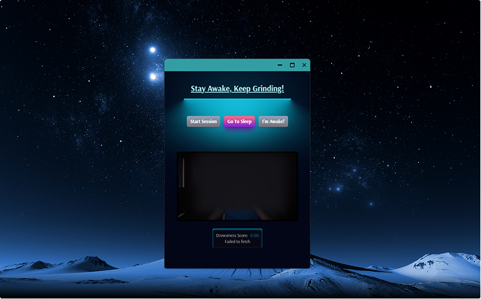

<h1 style="font-family: Arial, sans-serif; font-size: 36px;display: flex; align-items: center; border-bottom: 3px solid ; padding-bottom: 5px;">
  
  WAKEY-WAKEY - Desktop Alertness Companion
</h1>

<div align="center">
  
</div>

---

## ⚠️ Disclaimer
**WAKEY-WAKEY is under active development.**  
While functional if all steps are followed, it may contain bugs and is subject to change.  
The final version will be simple, intuitive, and fully stable—recommended to wait for the full release for production use.

---

## 📌 Overview
WAKEY-WAKEY is your **friendly desktop companion** designed to keep you **awake and alert**.  
It leverages **real-time computer vision** to monitor alertness using your webcam, triggering **customizable audio alerts** when drowsiness is detected.  

Perfect for students, professionals, night shift workers, or anyone needing focus during long sessions.

---

## 🚀 Features
- **Real-Time Drowsiness Detection**: Tracks eye closure, yawns, and facial expressions  
- **Smart Alert System**: Audio notifications triggered when drowsiness is detected  
- **Non-Intrusive**: Runs quietly in the background  
- **Local Processing & Privacy**: No data is sent externally  
- **Scientific Detection**: Uses EAR, MAR, and facial landmark analysis  

---

## 🛠️ Tech Stack

### **Backend**
 **Rust** – Low-level engine for Tauri  
 **Flask** – Python web backend  
 **Python 3.x** – AI & CV logic  

### **Frontend**
 **React** – UI library  
 **Vite** – Frontend build tool  
 **Tailwind CSS** – Utility-first styling  
 **PostCSS** – CSS processing  
 **Motion** – Smooth UI animations  

### **Platform**
 **Tauri** – Native desktop app packaging  

---

## 📁 Project Structure
```

├── flask-backend/     # Flask backend API
│   ├── venv/          # Python virtual environment
│   └── requirements.txt
├── src/               # React frontend source
├── public/            # Static assets
├── src-tauri/         # Tauri native app configuration
├── vite.config.js     # Vite config
├── tailwind.config.js # Tailwind config
└── postcss.config.js  # PostCSS config

```

---

## ⚙️ Installation

### 1️⃣ Clone Repo
```sh
git clone <repository-url>
cd wakey-waeky
```

### 2️⃣ Backend Setup

```sh
cd flask-backend
python -m venv venv
# Windows
venv\Scripts\activate
# Unix / MacOS
source venv/bin/activate
pip install -r requirements.txt
```

### 3️⃣ Frontend Setup

```sh
npm install
```

---

## 🚀 Development

### Start Backend

```sh
cd flask-backend
flask run
```

### Start Frontend

```sh
npm run dev
```

Access the app at `http://localhost:5173`.

---

## 🔧 Environment Configuration

Create a `.env` file in the root:

```env
VITE_API_URL=http://localhost:5000
FLASK_APP=app.py
FLASK_ENV=development
```

---

## 📦 Production Build

### Build Frontend

```sh
npm run build
```

### Build Native App with Tauri

```sh
npm run tauri build
```

---

## 🧪 Testing

### Backend

```sh
cd flask-backend
python -m pytest
```

### Frontend

```sh
npm test
```

---

## 🤝 Contributing

1. Fork the repo
2. Create a branch (`git checkout -b feature/amazing-feature`)
3. Commit your changes (`git commit -m "Add feature"`)
4. Push (`git push origin feature/amazing-feature`)
5. Open a Pull Request

---

## 📄 License

[](https://opensource.org/licenses/MIT)

Licensed under **MIT License** – see the [LICENSE](LICENSE) file.
