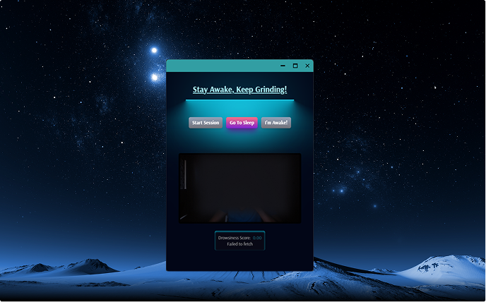

<h1 style="font-family: Arial, sans-serif; font-size: 36px;display: flex; align-items: center; border-bottom: 3px solid ; padding-bottom: 5px;">
  
  WAKEY-WAKEY - Desktop Alertness Companion
</h1>

<div align="center">
  
</div>

---

## ⚠️ Disclaimer
**WAKEY-WAKEY is under active development.**
It's mid-migration from a Python backend to an in-app TypeScript detection pipeline — expect rough edges, and treat anything below as a snapshot rather than a stable release.

---

## 📌 Overview
WAKEY-WAKEY is a **desktop companion** designed to keep you **awake and alert**.
It uses your webcam and real-time facial-landmark analysis to detect drowsiness (eye closure, yawning), triggering **customizable audio alerts** when it does.

Perfect for students, professionals, night-shift workers, or anyone needing focus during long sessions.

---

## 🚀 Features
- **Real-Time Drowsiness Detection**: Tracks eye closure and yawns via facial landmarks (Eye Aspect Ratio / Mouth Aspect Ratio)
- **Smart Alert System**: Rotating audio notifications (`sound1`–`sound5.mp3`) triggered when drowsiness is detected
- **Non-Intrusive**: Runs quietly in the background with a system tray presence
- **Local Processing & Privacy**: Detection now runs entirely in-app — no external backend, no data leaves your device
- **Scientific Detection**: EAR/MAR thresholds over MediaPipe FaceLandmarker output

---

## 🏗️ Architecture — mid-migration

The app originally shipped with a local **Flask/Python** backend for the computer-vision inference. That backend (`app.py`, `requirements.txt`, `autoInstall.bat`, `installRequirements.bat`) has been **removed** in favor of running detection directly in the frontend via `@mediapipe/tasks-vision` (`src/lib/detector.ts`), using MediaPipe's `FaceLandmarker` (GPU-delegated, WASM runtime) to compute eye/mouth aspect ratios frame-by-frame — no Python, no separate server process.

This migration is still being wrapped up:
- `detector.ts` is written and wired, but hasn't been fully committed/verified end-to-end
- `Home.jsx` / `Settings.jsx` have in-flight edits adapting the UI to the new in-app pipeline
- The old `.env` variables (`VITE_API_URL`, `FLASK_APP`) are obsolete now that there's no Flask backend to point at

---

## 🛠️ Tech Stack

### **Detection**
 **MediaPipe Tasks Vision** – in-app face-landmark detection (replaces the old Python/Flask CV service)

### **Frontend**
 **React** – UI library
 **TypeScript** – detection/typing layer
 **Vite** – frontend build tool
 **Tailwind CSS** – utility-first styling
 **Motion** – smooth UI animations

### **Platform**
 **Tauri** – native desktop app packaging, tray icon, and shell/fs plugins

---

## 📁 Project Structure
```
src/
├── lib/
│   └── detector.ts        # In-app MediaPipe FaceLandmarker-based drowsiness detection
├── pages/                 # Home, Settings
├── components/            # Tray, Lamp, Video UI components
├── assets/sounds/          # Alert sounds (sound1..sound5.mp3)
public/
src-tauri/                 # Tauri native app configuration (tray, fs, shell)
vite.config.js
tailwind.config.js
```

---

## ⚙️ Installation

```sh
git clone https://github.com/mohaneddz/Waeky-Waeky
cd Waeky-Waeky
npm install
```

No Python setup is required anymore — the old Flask backend steps have been removed.

---

## 🚀 Development

```sh
npm run dev
```

Or run the full desktop shell:

```sh
npm run tauri dev
```

---

## 📦 Production Build

```sh
npm run build
npm run tauri build
```

---

## 🤝 Contributing

1. Fork the repo
2. Create a branch (`git checkout -b feature/amazing-feature`)
3. Commit your changes (`git commit -m "Add feature"`)
4. Push (`git push origin feature/amazing-feature`)
5. Open a Pull Request

---

## 📄 License

[](https://opensource.org/licenses/MIT)

Licensed under **MIT License** – see the [LICENSE](LICENSE) file.
